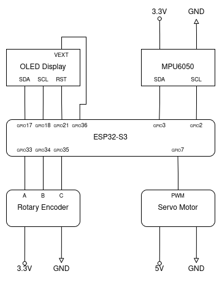

# One axis stabilizer

This project aims at using an ESP32-S3 to develop a single axis stabilizer.
It relies on several hardware components:
- a MPU6050 for its gyroscope capabilities
- a rotary encoder, the EC11D0-016
- a Micro Servo SG90 Datenblatt

# Dependencies

This project is possible thanks to :
- FreeRtos for Rust implementation by the [ESP-IDF-SVC](https://github.com/esp-rs/esp-idf-svc) project 
- [ssd1306 crate](https://docs.rs/ssd1306/latest/ssd1306/)
- [Embedded Graphics Crate](https://docs.rs/embedded-graphics/latest/embedded_graphics/) 

# Usage 

This project assumes the following wiring of the different components:

Though, one could change the pins used inside [main.rs](./src/main.rs).

## Gyroscope

The gyroscope tracks speed along the given axis (default: *x axis*).
Speed is then summed up over time to compute the current angular position.

The possible axes are x, y, z and correspond to real life axes as noted on the MPU6050.
One can change the axis tracked inside [main.rs](./src/main.rs).

## OLED Display

The OLED display is updated once per second and displays useful informations about the state of the system.
- *angle*     : the angle relative to the one at the start of the system 
- *threshold* : the current threshold used for reducing motor jitter 
- *compass*   : a rudimentary representation of the equilibrium. 
                The bar shows the equilibrium direction relative to the starting position.
                The level shows how far the current angle is from the equilibrium.
                The system is at equilibrium when the bar and the level are perpendicular.
- *freeze*    : when the motor is frozen in place, the pixels are all inverted

## Rotary Encoder 

The rotary encoder is used to control the system.
There are two possible actions:
1) turn the encoder
2) press on the axial button

**Turning the encoder** :
Used to set a threshold which acts as a *dead zone* around the current position of the motor.
Meaning, the motor won't update its position until the update is outside the *dead zone*.
This reduces the jittering of the motor due to inaccuracies/noise at the gyroscope level.

**Pressing the button** :
A *short press* (~0.1s) freezes the motor to its current position while the gyroscope keeps measuring the current angle.
A second *short press* re-enable the motor.

A *long press* (~1s) sets the equilibrium position to the current one.

# Author

Eliot Tritschler

# References

- ESP32-S3 References
  - [ESP32-S3 Technical Reference Manual](https://www.espressif.com/sites/default/files/documentation/esp32-s3_technical_reference_manual_en.pdf) 
  - 
- Espressif Rust documentation
  - [ESP-RS Github](https://github.com/esp-rs)
  - [ESP-HAL Github](https://github.com/esp-rs/esp-hal)
- Others
  - [Atomic Floats Implementation](https://github.com/rust-lang/rust/issues/72353#issuecomment-1093729062)
  - [MPU60X0 Datasheet](https://www.invensense.com/wp-content/uploads/2015/02/MPU-6000-Datasheet1.pdf)

